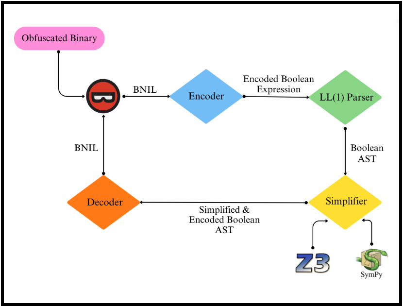

# MBASED: Practical Simplifications of Mixed Boolean-Arithmetic Obfuscation


Mixed Boolean-Arithmetic (MBA) obfuscation is a technique that transforms simple boolean expressions into complex expressions by combining arithmetic and boolean operations. It serves the purpose of making code more difficult to analyze, protecting software from reverse engineering and tampering. Conversely, mixed boolean-arithmetic deobfuscation aims to simplify obfuscated boolean expressions. In this paper, we present a Binary Ninja plugin called MBASED (Mixed Boolean-Arithmetic Simplification Engine for Deobfuscation) that performs mixed boolean deobfuscation within C programs to assist reverse engineers in understanding them. We first created a system that processes boolean expressions and converts them into a parse tree. We then employed the Python library, SymPy, and the SMT Solver, Z3, to simplify the boolean expressions, and print the results to the Binary Ninja console. MBASED substantially decreases the number of variables and operations within boolean expressions, indicating boolean simplification.

This research project was conducted as part of the of the [New Jersey Governor's School of Engineering and Technology](https://soe.rutgers.edu/academics/pre-college-engineering-programs/new-jersey-governors-school-engineering-and-technology) 2024 program.

## Extending MBASED
A powerful design feature of MBASED is that similar to compiler frameworks like LLVM, it is easy to improve upon the underlying MBA solver by extending the plugin. MBASED takes an MLIL instruction, part of the BNIL intermediate representation stack, produced by Binary Ninja and uses an encoder and an LL(1) parser to produce an abstract syntax tree (AST) of a boolean expression allowing simplifications to be performed on the underlying AST rather than the raw output produced of the decompiler. Each simplification of the AST can be written as an optimization pass similar to LLVM where a transformation is performed on the AST. To extend MBASED and add your own pass, create a file inside `solver/passes` with a single function `run_pass(ast: Expr) -> Expr:`. MBASED also provides a set of visitors which can be used to easily traverse and simplify the AST. To see what visitors are available, check out `parser/visitor.py`. To see an example of how to write a pass, see [example_pass.py](solver/passes/example_pass.py).

## Dependencies
In order to use or contribute to MBASED, you will need the following dependencies:

- [Binary Ninja](https://binary.ninja/): An interactive decompiler made by [Vector35](https://vector35.com/).
- [Z3](https://github.com/Z3Prover/z3): A high-performance theorem prover being developed at Microsoft Research.
- [Sympy](https://www.sympy.org/en/index.html): A Python library for symbolic mathematics.

## Installing and Using MBASED
To install MBASED, you will need to clone this repository into your Binary Ninja plugins directory. To find where your plugins directory is, open Binary Ninja and navigate to `Plugins > Open Plugin Folder` in the navigation bar. Then, clone this repository into the plugins directory using the following command.

```
git clone https://github.com/bliutech/mbased.git
```

Relaunch Binary Ninja, and you should see the MBASED plugin in the plugins list. To use MBASED, after installation, you can load a target binary for analysis in Binary Ninja. From there, navigate to `Plugins > MBASED: Simplify all MBA expressions` and see the resulting output in the Binary Ninja logs. If you want to see the decompilation which corresponds to the simplified MBA expression, click on the address for the simplified value in the logs and Binary Ninja will navigate to the corresponding area in the intermediate representation.

## Running Experiments
As part of this repository, there is an `experiments` module which can be run using `run_experiment.py` to test various configurations of the `Solver`. To run an experiment, use the following commands.

```bash
cd mbased/
mv run_experiment.py ..
cd ..
python3 run_experiment.py
```

## Contributing
To contribute to this project, please open a pull request with your changes. If you are unsure about the changes you want to make, please open an issue to discuss it with one of the authors. For code health, please ensure that your code is clear and formatted. You can use the `black` code formatter to format your code. To install `black`, run `pip install black`. To format your code, run the following command.

```
python -m black *.py */*.py
```

Formatting is checked using a GitHub action, so please ensure that your code is formatted before opening a pull request. We also try and follow good practices by adding type hints to our code.

## Authors
MBASED was developed by Nitin Krishnaswamy, Sanjana Mandadi, Micah Nelson, and Timothy Slater for GSET 2024. Their project was advised by Benson Liu as their project mentor and Aashi Misha as their project Resident Teaching Assistant (RTA). For questions or requests for additional information, please contact the authors.
